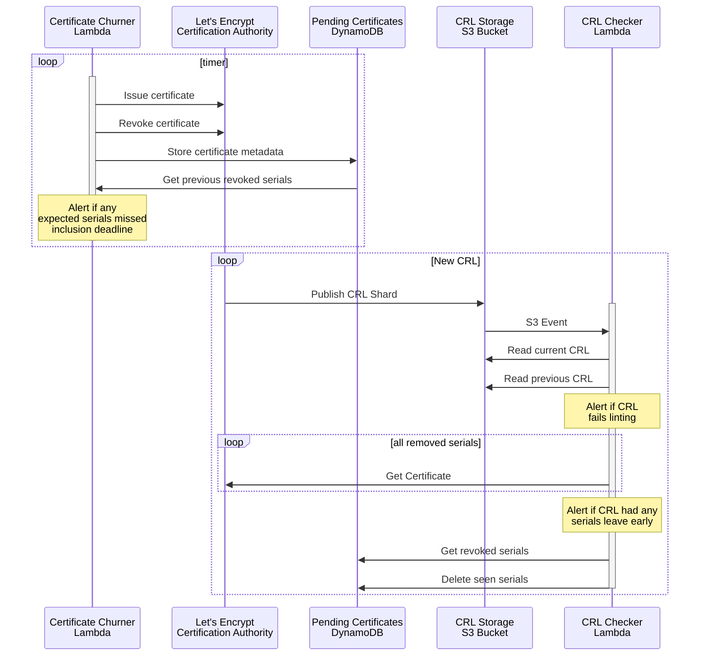

# crl-monitor

CRL-Monitor monitors CRLs

## Architecture Diagram

```mermaid
sequenceDiagram
  participant churn as Certificate Churner<br />Lambda
  participant ca as Let's Encrypt<br />Certification Authority
  participant ddb as Pending Certificates<br />DynamoDB
  participant s3 as CRL Storage<br />S3 Bucket
  participant checker as CRL Checker<br />Lambda

  loop timer
    activate churn
    churn->>ca: Issue certificate
    churn->>ca: Revoke certificate
    churn->>ddb: Store certificate metadata
    ddb->>churn: Get previous revoked serials
    Note over churn: Alert if any<br />expected serials missed<br />inclusion deadline
    deactivate churn
  end

  loop New CRL
    ca->>s3: Publish CRL Shard
    activate checker
    s3->>checker: S3 Event
    checker->>s3: Read current CRL
    checker->>s3: Read previous CRL
    Note over checker: Alert if CRL<br />fails linting
    loop all removed serials
      checker->>ca: Get Certificate
    end
    Note over checker: Alert if CRL had any<br />serials leave early
    checker->>ddb: Get revoked serials
    checker->>ddb: Delete seen serials
    deactivate checker
  end
```
