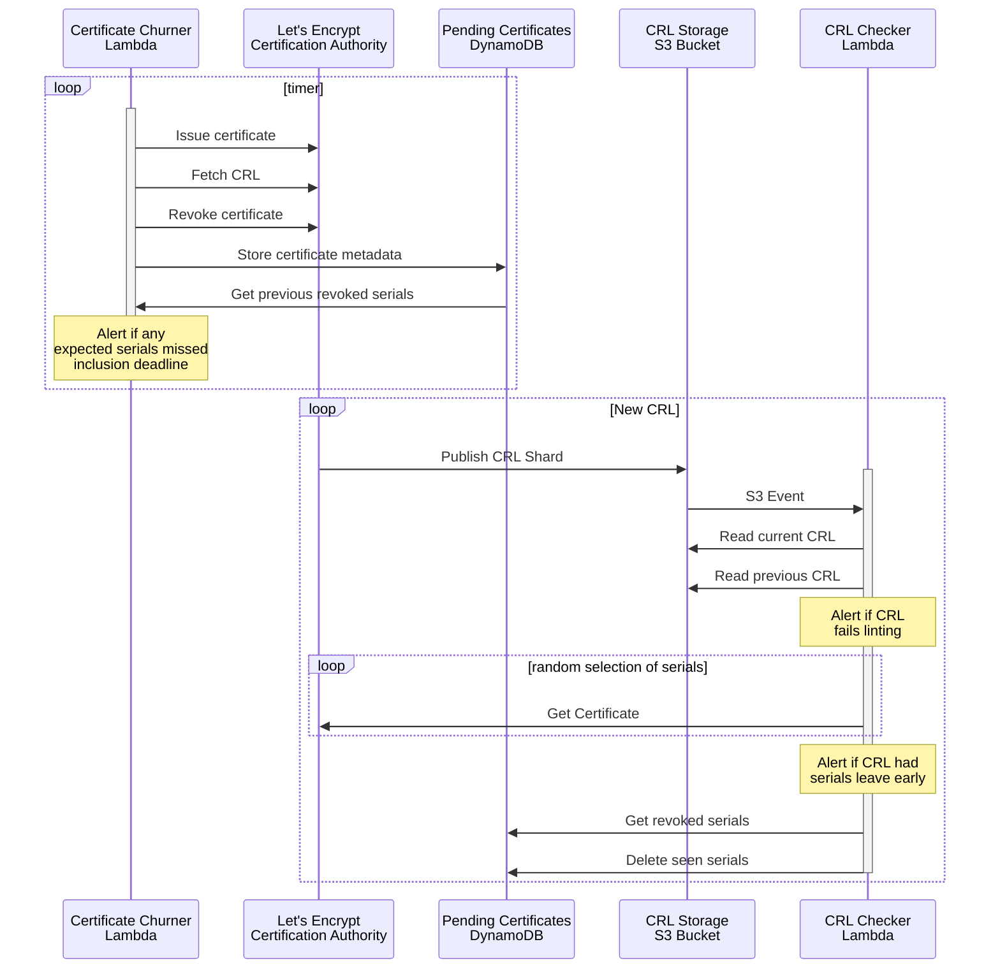

# crl-monitor

CRL-Monitor monitors CRLs.

It issues certificates, revokes them, and then looks for them to appear in CRLs.
Each component runs as an AWS Lambda.

The `churner` runs periodically. On each run it issues a certificate, fetches and lints
the certificate's CRL URL, revokes the certificate, and stores its serial number and metadata
for the `checker` to later verify that it shows up as revoked. It also checks previously
seen serials. If they haven't shown up in a CRL after a reasonable amount of time, `checker`
produces an error.

The `checker` runs in response to the upload of each new CRL shard in S3. It diffs the newly
uploaded CRL shard against its previous version and verifies:

 - New CRL has a later date and higher CRL number than the previous version.
 - New CRL passes lints.
 - For any serials removed between the old shard and the new one:
   - The certificate is expired (based on fetching it by serial from Let's Encrypt).
 - For any serials added (if the certificate was issued by the churner):
   - The certificate's CRLDistributionPoint matches the CRL shard's IssuingDistributionPoint.

The `checker` also removes from database any certificates it sees, to indicate that their
revocation has been published, so the `churner` won't alert about them
It then marks as completed (deletes) any `churner`-issued certificates that show up on
the new CRL.

## Build and Deployment

This repository has two binaries named `checker` and two binaries named `churner`. The
binaries under `cmd` are for local use and testing. The binaries under `lambda` are for
deployment to AWS Lambda. The key difference is that the `lambda/` binaries register a
lambda handler ([`lambda.StartWithOptions()`]), which AWS then calls. That
[handler can return errors], and we have separate Cloudwatch monitoring that alerts when
any errors are detected.

The lambda binaries are built by a release workflow on GitHub Actions triggered by uploading
a release tag (starting with `v`). Those binaries are uploaded to S3 under a versioned path.
They are then deployed to Lambda using Terraform (in another repository).

[`lambda.StartWithOptions()`]: https://pkg.go.dev/github.com/aws/aws-lambda-go/lambda#StartWithOptions
[handler can return errors]: https://docs.aws.amazon.com/lambda/latest/dg/foundation-progmodel.html

## Testing

Most of the tests are unittests and can be run with:

    go test ./...

There is also an integration test for DynamoDB code. To run this, install Java and run:

    ./db/run_integration_test.sh

## Architecture Diagram

